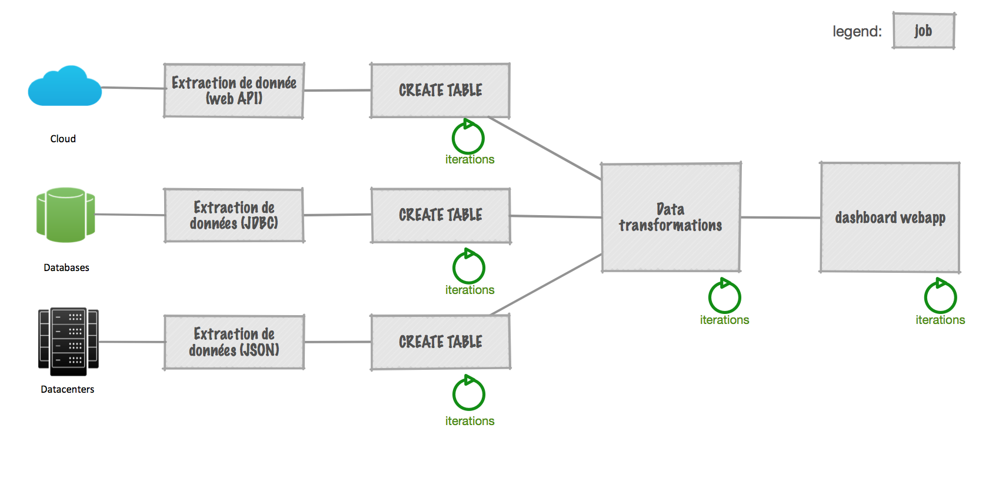
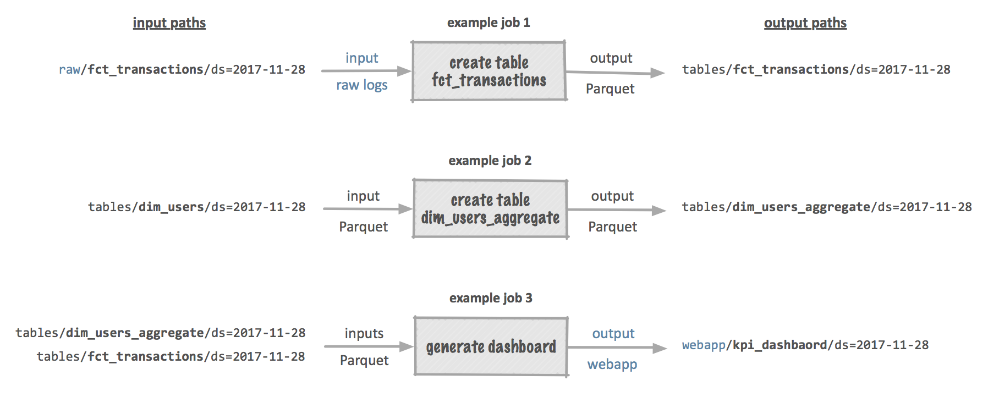

# dsflow [beta release]

v-0.3.1


_IMPORTANT: this is an early release of dsflow. It enables you to prototype data pipelines your own computer. Support for deployment to cloud platforms will come in a future release._


**Contents:**

<!-- TOC depthFrom:2 depthTo:2 withLinks:1 updateOnSave:1 orderedList:0 -->

- [What is dsflow?](#what-is-dsflow)
- [TL;DR;](#tldr)
- [Tech stack 360](#tech-stack-360)
- [Core principles](#core-principles)
- [Documentation](#documentation)
- [Current limitations / hacks](#current-limitations-hacks)

<!-- /TOC -->


## What is dsflow?

We're pleased to introduce _dsflow_ — the **framework for data science**.

_Dsflow_ helps you build powerful and flexible **pipelines for data analytics**.
The current version is designed for use on your local computer, using the **command line interface**.
Eventually you'll be able to use dsflow to deploy your pipelines to cloud platforms.

Interested? Subscribe to our mailing list on [dsflow.io](http://dsflow.io)

## TL;DR;

- install or update Docker 🐳 (`brew cask install docker`)
- clone this git repository (`git clone ...`) and `cd` into it.
- execute `source init.sh` to initialize the dsflow environment and build docker images (_it might take over 10 minutes to download all sources_ ☕️)
- execute `dsflow` to see the list of dsflow commands
- execute `dsflow generate-job`: display the list of job templates
- execute `dsflow generate-job TEMPLATE_NAME JOB_NAME`: generate a job based on a template
- execute `dsflow run JOB_NAME [JOB_PARAMETERS]`: runs the job in its associated container
- execute `dsflow start-jupyter` to open the default IDE in your browser (Jupyter Lab with pyspark) at http://localhost:8888/ (default password = `green3`)
- execute `dsflow stop-all` to terminate all dsflow Docker containers.

See documentation below for detailed instructions.


## Tech stack 360

Those are the defaults when adopting dsflow:

- Run everything within containers  (using [Docker](https://www.docker.com/what-docker)).
- Query and transform data with [Apache Spark 2.2](https://spark.apache.org/).
- Store data as [Parquet files](https://parquet.apache.org/).
- Write code and iterate on your scripts using [Jupyter](http://jupyter.org/).
- Orchestrate your jobs and pipelines with [Apache Airflow (incubating)](https://airflow.apache.org/) – _not implemented yet_.
- Build powerful dashboards with [Plotly Dash](https://plot.ly/dash/).
- Collaborate with your team using Github (or any [version control systems](https://en.wikipedia.org/wiki/Version_control)).


## Core principles

**Note**: if you're not familiar with the following principles,  
dsflow CLI and dsflow Job Templates will help you adopt them.

- a) Pipelines are made of jobs
- b) Separation of compute and storage
- c) Containerization
- d) Daily partitions of data


### a) A pipeline is a chain of jobs

The concept of _pipeline_ in dsflow inherits from the concept of _DAG_ in Airflow.  A _Directed Acyclic Graph_ is a collection of all the jobs you want to run, organized in a way that reflects their relationships and dependencies.

A data pipeline is also called a _workflow_.

Once you have created jobs (with `dsflow generate-job`) you can assemble them into pipelines using Airflow. See [Documentation](#documentation) and http://github.com/dsflow-io/dsflow-sample-projects for more details.


#### Typical dsflow pipeline




#### Zoom on jobs: inputs and outputs

_Jobs_ are single units of data transformation. They take one or multiple **inputs** and produce an **output**. Most of the work of Data Scientists consists in creating jobs, and improving them constantly, through successive iterations.

Notebook environments are well suited for data exploration and experimentation. Then it's natural to turn a notebook into a job. With dsflow, you'll be able to parametrize your notebooks by specifying input and output values. Notebooks become **first-class** jobs.





### b) Separation of compute and storage

Unlike traditional databases, dsflow relies on the principle of separation of compute and storage.

When you run dsflow on your computer, your resources -- **data**, jobs, notebooks, docker files -- are stored in distinct directories. It's organized in a way that simplifies future deployment of your pipelines to the cloud.

**Data** is stored in a directory called `datastore/`:

- as such you could use any Big Data compute engine (Spark, Hive, Presto, etc.) to query it.
- this `datastore/` directory can be local or distant
- \[future release\]: dsflow will help you download samples of your production datastore, so that it gets easier to iterate locally on smaller datasets.
- \[future release\]: dsflow will help manage multiple datastores, in order to provide access control and better resources management.

**Scripts** are stored in a directory called `jobs/`:

- they are distinct from the data they process.
- all jobs MUST take **input** and **output** parameters (or **source** / **sink** parameters), because the logic has to be independent from what it processes.  
For instance, a given job should be able to process either local data or distant data.


### c) Containerization

Running your jobs within Docker containers bring many advantages:

- **No more library conflicts**  
Big data tools and ML libraries keep evolving. Being able to run each script in an isolated environment is critical in order to avoid conflicts, and run both legacy script and cutting edge logic.
- **Easily adopt newest Data Science tools**  
New tools and libraries running in containers won't break legacy software.
- **Portability**  
Execute a script on your laptop or in the cloud seamlessly. Stay independent from your cloud provider.
- **Scalability**  
Each task (instance of a job) runs in its own container. It allows a better allocation of resources: running tasks in parallel, using a memory configuration optimized for each task.


### d) Daily partitions of data

_\[important: this section is merely about conventions\]_

The acronym `ds` not only stands for Data Science, it's also the default name for date partitions following ISO format (e.g. `my_table/ds=2017-11-27/`).

If you store your data with daily `ds` partitions, the meaning of it will depend on whether you deal with dimensions tables (`dim`) or fact tables (`fct`).

#### In case of a "dimension" table:

Each `ds` partition shall contain a whole snapshot of the table.
For instance, `users/ds=2017-11-27/` will contain a **dump** of the `users` table made on 11/27/2017.

It brings the following benefits:

- daily versioning of your data
- keeping daily snapshots of a dataset makes it easier to compute KPIs and monitor the evolution of the metrics
- you avoid overwriting data, instead you append by creating a new partition.
- you can safely delete older snapshots of your tables once there are no longer needed.

Note: as a convention, such a table is prefixed with `dim_`

#### In case of a "fact" table:

Each `ds` partition shall contain the facts of that day.  
For instance, `transactions/ds=2017-11-27/` will contain the events the transactions logged on 11/27/2017.

- it's a standard way to store large datasets
- it makes it easier to optimize queries of large datasets, by selecting the `ds` range that matters

Note: as a convention, such a table is prefixed with `fct_`


#### Meaning of `ds` partitions with dsflow:

By default, dsflow jobs will take a single `ds` partition as input, and output to the same `ds` partition of a target table.

#### Weekly partitions? Hourly partitions?

Daily `ds` partitions are the default setting of dsflow Job Templates. We follow the conventions of Airflow. See for instance the [HivePartitionSensor](https://airflow.apache.org/code.html?highlight=%20ds#airflow.operators.HivePartitionSensor).

Monthly, weekly, or hourly partitions are also possible.


## Documentation

### Requirements

Brew and Python need to be installed on your system.
If not, execute in your terminal:

```
xcode-select --install
```

```
ruby -e "$(curl -fsSL https://raw.githubusercontent.com/Homebrew/install/master/install)"
```

```
brew install python
```

A recent version of Docker is needed:

```
brew cask install docker
```

Installation on Ubuntu: https://docs.docker.com/engine/installation/linux/docker-ce/ubuntu/


**Frequent issues when installing dsflow on macOS**

- xcode: If your it is outdated, update it with the app store, or just move it to Trash.
- Python: dsflow CLI works with Python 2.7 and 3.3+ and only requires the `pyyaml` module in addition to core modules. Scripts with additional requirements will run in containers.
- Docker: make sure it's running before launching dsflow.
- Docker-compose: make sure it's up-to-date (dsflow requires support for version '3.3')


### Initialize dsflow

Inside the dsflow project directory:

```
source init.sh
```

**In depth:**

This will set up environment variables and provide a shortcut to dsflow commands.  
For instance, `dsflow tree` will execute `python dsflow/dsflow-tree.py`


### Show list of available commands

```
dsflow
```


### Show list of job templates

```
dsflow generate-job
```

Without argument, this command will show the list of job templates.


### Generate a job from a template

```
dsflow generate-job TEMPLATE_NAME JOB_NAME
```

In order to build a typical end-to-end data pipeline, you may use the following commands:

```
dsflow generate-job download_file datasetname           --> 1st job will download data
dsflow generate-job create_table_from_json datasetname  --> 2nd job will transform data into a parquet file ("table")
dsflow generate-job create_table_from_sql tablename     --> 3rd job will deal with data transformations using Spark SQL
dsflow generate-job plotly_dash_app tablename           --> Last job launches a dashboard, build with Plotly Dash.
```

The jobs won't run automatically when calling `dsflow generate-job ...`

**Hint**: Discover open data source on https://data.opendatasoft.com/explore/?q=meteo


### Run a notebook:

```
dsflow run JOB_NAME [PARAMETERS]
```

For instance:

```
dsflow run download-meteoparis 2017-11-09
dsflow run create-table-meteoparis 2017-11-09
```

With `dsflow run`, each job will run in its own container.  
By default, job outputs are saved to `datastore/`.


**What happens when a notebook-based job is run by dsflow?**

1. render job specifications as defined in job_specs.yaml,
   and pass it as an environment variable.
2. launch proper container
3. execute nb-convert utility within the container
4. notebook reads job specifications from environment variable
5. notebook is rendered as html and saved to datastore
   (goal: provide easy debugging in case something goes wrong)


### Launch notebook environment to edit your notebooks

```
dsflow start-notebook
```

Default password is `green3`.

This command launches Jupyter Lab in a container: it's a full IDE, featuring notebooks and advanced code edition capabilities.

**In depth**

The main directories are mounted on this container: `jobs/`, `adhoc/`, `datastore/`.

`datastore/` is also mounted as `/data/` on the container. All paths pointing to the datastore (source or sink) should refer to `/data/` to provide consistent paths across containers.

(modify the default password: property `c.NotebookApp.password`
  in `dsflow/config/jupyter-conf/jupyter_notebook_config.py`)


### Pipeline creation and scheduling with Airflow

(1) Add your airflow DAGs to `airflow/dags/`.

You can run dsflow jobs using Airflow using a BashOperator.
This Operator shall call `dsflow run JOB_NAME [PARAMETERS]`

For instance:

```py

def dsflow_job_operator(job_name):
    return BashOperator(
        task_id=job_name,
        bash_command="python $DSFLOW_ROOT/dsflow-run.py {{ params.job_name }} {{ ds }}",
        params={'job_name': job_name},
        dag=dag)


t1 = dsflow_job_operator("download-meteoparis")
t2 = dsflow_job_operator("create-table-meteoparis")
t3 = dsflow_job_operator("create-table-meteo_agg")

t1 >> t2 >> t3
```

(See a full DAG example in http://github.com/dsflow-io/dsflow-sample-projects)


(2) Open the Airflow web UI with `dsflow start-airflow`.
Airflow URL is http://localhost:8081

(3) Use the toggle to activate your DAG. If its `start_date` is yesterday or sooner,
then Airflow will start running the job.


## Troubleshooting

If you face an error, take a screenshot / copy the logs and create an issue in Github (or mail it to pm@dsflow.io)

### Stop all containers and reset all

- run `dsflow stop-all`
- restart Docker (on Mac, in the Docker menu)
- clear tempora


## Next dsflow release

We will add a `dsflow generate-dag` command to assist you
in the creation of new pipelines from existing jobs.


## Current limitations / hacks

- Dsflow CLI uses python scripts to execute `docker-compose`... that's definitely NOT a great design. In the future we'll either use 100% bash scripts or use docker Python libraries.
- Currently, the `ds` partition is compulsory. We're not making it easy to use hourly or weekly partitions of data.
- Fact tables vs. dimension tables: this is pure convention... dsflow doesn't yet help you deal specifically with one type or the other. It's an issue when running `dsflow.load_tables()`: we assume that all tables are fact tables, and all partitions are loaded. Don't forget to filter your table using the `ds` partition.
